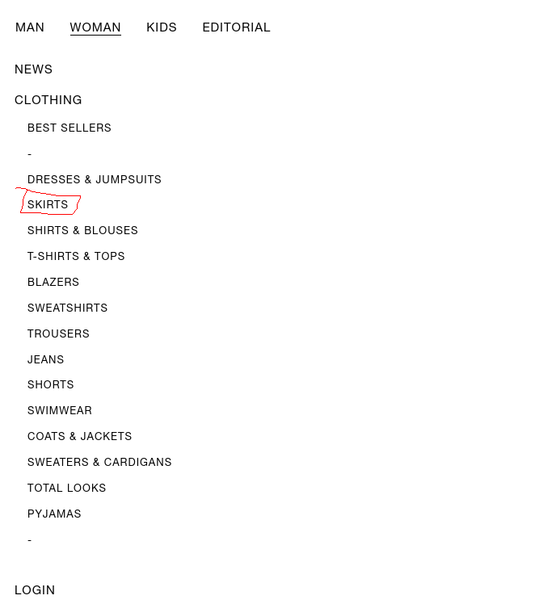

# Clothes scrapping

Web scrapping use case from a data engineer test. The original data tests is in the zip file "original_test.zip".

# Index

1. Test README file
2. Directory tree
3. Function dictionaries


# 1. Test README file
 

## The task

We are dedicated to offering our customers clothing that perfectly matches their unique style.
Also, we continuously add new suppliers every day to ensure a greater variety for our customers.
It is planned to include [Scalpers](https://en.gb.scalperscompany.com/) to our catalog. To do this, we need to gather all their product data. This will allow us to run it through our recommendation system and offer their products to our customers.

Our web scraping pipelines will run as on-demand batch jobs in a serverless deployment. Therefore, we need an automated process to install dependencies during deployment and maintain a clear structure to establish an entry point for the Docker image.

Your task is to modify [scrap.py](scrapper%2Fscrap.py) to be able to scrap a list of products from this
webpage https://en.gb.scalperscompany.com/collections/woman-new-collection-skirts-2060.
Which is the "skirts" from the woman clothing collection from [scalpers](https://en.gb.scalperscompany.com/).



If the link is broken, we want to evaluate your ability to write code for extracting data from the web. Any collection of products from that shop will be acceptable.

The output should be a JSON containing a list of all the skirts. You can refer to schema/product.py for the output format. The format is minimal, so feel free to enhance it based on the available data for each product on the webpage.

Using [this product](https://en.gb.scalperscompany.com/products/bbcstudio24-50505-strapless-linen-dress-ss24-red) as
input, an example of how the output looks like for our schema is the next:

```json
{
  "roduct_url": "https://en.gb.scalperscompany.com/products/bbcstudio24-50505-strapless-linen-dress-ss24-red",
  "product_name": "LINEN MIDI DRESS WITH DRAPED CHEST",
  "sku": "8445279814248",
  "metadata": [
    "Made of 100% cotton",
    "Regular fit",
    "Square neckline",
    "Zip fastening",
    "Thin straps with ruffle detail"
  ],
  "images": [
    "https://en.gb.scalperscompany.com/cdn/shop/files/BBC-50505-RED-2_8392707e-c459-4eb2-b8d5-20dd3bba8b2c.jpg?v=1715950630",
    "https://en.gb.scalperscompany.com/cdn/shop/files/BBC-50505-RED-2_8392707e-c459-4eb2-b8d5-20dd3bba8b2c_800x.jpg?v=1715950630",
    "https://en.gb.scalperscompany.com/cdn/shop/files/BBC-50505-RED-1_12cca2fa-3e2c-4e18-b145-927e0cae6c1b.jpg?v=1715950630",
    "https://en.gb.scalperscompany.com/cdn/shop/files/BBC-50505-RED-1_12cca2fa-3e2c-4e18-b145-927e0cae6c1b_800x.jpg?v=1715950630",
    "https://en.gb.scalperscompany.com/cdn/shop/files/BBC-50505-RED-3_70b33f83-8a5d-4604-8cfe-d342011d122e.jpg?v=1715950630",
    "https://en.gb.scalperscompany.com/cdn/shop/files/BBC-50505-RED-3_70b33f83-8a5d-4604-8cfe-d342011d122e_800x.jpg?v=1715950630"
  ],
  "price": "£104",
  "sizes": [
    "XS",
    "S",
    "M",
    "L",
    "XS",
    "S",
    "M",
    "L"
  ],
  "cloth_type": "dress"
}
```

Once again, if you think the schema can be improved, feel free to make enhancements as you see fit.

You can find a minimal code example using BeautifulSoup4 in scrapper/scrap.py, which successfully scrapes the product_name for the product mentioned above.

You don’t need to use BeautifulSoup if you’re not comfortable with it. We've provided an example, but feel free to use any tools that will help you succeed in the task. Make this repository your own!

If you have enough time, it would be great to add clothing type as a parameter for the script. For example, you could run python -m scrap --type skirts or python -m scrap --type shirts, and it would return all the items for skirts or shirts, respectively.

## How to proceed?

To install dependencies, feel free to use any method you prefer. We use [Poetry](https://python-poetry.org/ for dependency management, but you can also use the provided requirements file. We've provided a set of tools to start with, but you don't need to use the same libraries. If you're more comfortable with different dependencies, feel free to continue the work with them!

Feel free to use any tools you prefer, including any IDE, Copilot, or ChatGPT. It's not required, so use them only if you want to.

You should aim to spend no more than 2-3 hours on this project, as that should be sufficient to demonstrate how you structure your work.

All code, including comments, should be in English.

### Once you finish the project

Please zip the folder contents, including the .git folder so we can review the commit history. Exclude folders like .venv, __pycache__, .idea, and anything typically included in a .gitignore file to keep the directory clean.

Make sure to include instructions on how to run your code, and ensure that the code is functional.

After you submit the code, we’ll have a session to review your work. This will give you the opportunity to explain your process and share any relevant insights. We’ll provide feedback on what we liked and what could be improved.

## What are we looking for?

Don’t worry if you don’t finish the task within the timeframe. We want to see how you approach the problem.

* We want to see a clear commit history that reflects your work process.
* Clean code is essential. Not every method and class needs comments; if the code is self-explanatory, that’s sufficient.
* Following common development standards is important, so well-structured code and architecture are welcomed.


# 2. Directory tree

```
.
├── Dockerfile
├── Makefile
├── README.md
├── app
│   ├── __init__.py
│   └── modules
│       ├── __init__.py
│       ├── get_all_products_from_collection.py
│       └── get_all_products_from_shop.py
├── assets
│   └── untitled.png
├── original_test.zip
├── pyproject.toml
├── requirements.txt
├── schema
│   └── product.py
├── src
│   ├── __init__.py
│   ├── links_getter
│   │   ├── __init__.py
│   │   ├── get_all_collection_links.py
│   │   ├── get_all_products_links.py
│   │   └── get_product_links_from_page.py
│   ├── scrapper
│   │   ├── __init__.py
│   │   └── scrap.py
│   └── test
│       └── get_link_first_product.py
└── tests
    ├── assets
    │   └── example_skirt_000.html
    ├── test__src__links_getter__get_all_collection_links.py
    ├── test__src__links_getter__get_all_products_links.py
    ├── test__src__links_getter__get_product_links_from_page.py
    ├── test__unit__get_link_first_product.py
    └── test__unit__src_scrapper__scrap.py
```


# 3. Function dictionaries

## src

### links\_getter

#### get\_product\_links\_from\_page.py
This function return an array of URL products retrieving only the links with status 200. The input is an URL from a collection page.

#### get\_all\_products\_links.py
Similar to the previous function but retieving all products URLs at shop homepage.

#### get\_all\_collection\_links.py
It is almost the same function as the previous one. In this case, it returns an array of collection URLs.

### scrap

#### scrapper.py
The function that get all the product information by scrapping the product page URL. The product data is stored in a dictionary.


## app
#### get\_all\_products\_from\_collection.py
This script runs recursively `scrapper.py` to get an array of product data from all collection items.

